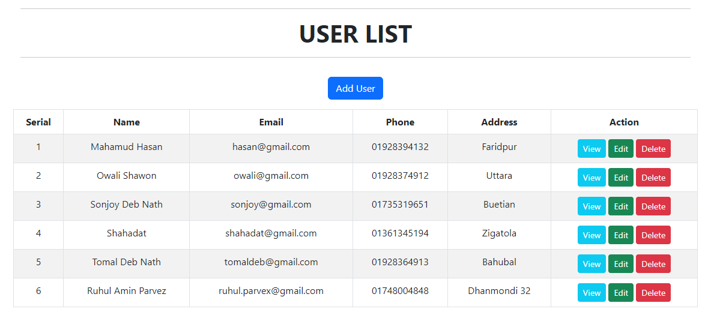
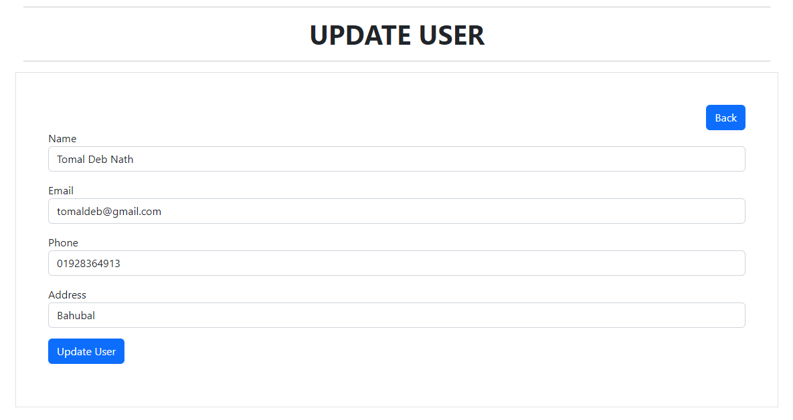

# PHP CRUD 
PHP CRUD Operation with MySQL ⚡

## Overview
This is a simple PHP CRUD application. It is a simple application that can be used to create, read, update and delete data from a MySQL database. It is a simple application that can be used to create, read, update and delete data from a MySQL database.

## Technologies Used
- PHP
- MySQL
- HTML
- Bootstrap

## Screenshots
HomePage

Add New Record

Edit Record

View Record
